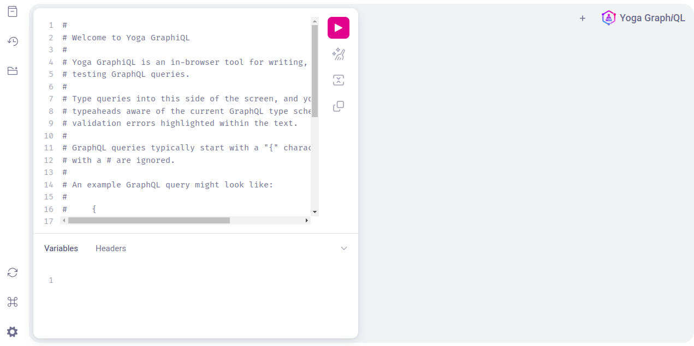

# GraphQL Mesh SDK

GraphQL Mesh is an open-source tool that allows you to transform, integrate, and query multiple data sources with GraphQL. It can be thought of as a way to create a unified GraphQL API layer over various sources of data, which might include other GraphQL services, REST APIs, SOAP services, gRPC services, SQL databases, and more.

The Mesh SDK (Software Development Kit) is a component of GraphQL Mesh that allows developers to directly interact with the unified GraphQL API created by GraphQL Mesh in their code. Essentially, it's a set of tools and libraries generated by GraphQL Mesh based on the unified schema it creates from various data sources. This SDK enables developers to execute GraphQL operations (queries, mutations, and subscriptions) programmatically within their applications, leveraging the GraphQL Mesh layer without needing to manually send HTTP requests or deal with low-level networking tasks.

## _Start the application:_

```sh
npm install
npm run start:dev
```

Navigate to: http://localhost:3000/graphql



## _To generate the .mesh folder:_

```sh
npm run generate-schema
```

## _Example queries to access the countries, anime and pet store data:_

```sh
query GetCountry {
  country(code: "BR") {
    name
    native
    capital
    emoji
    currency
    languages {
      code
      name
    }
  }
}

query GetAnimeCharacter {
  Character(id: 1) {
    name {
      first
      last
    }
    image {
      large
    }
    age
    description
  }
}

query GetPetById {
  getPetById(petId: 10) {
    name
    category {
      id
      name
    }
  }
}
```
